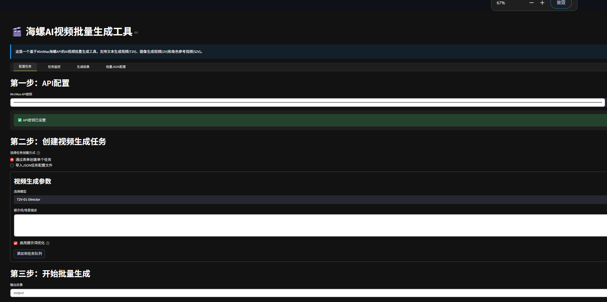
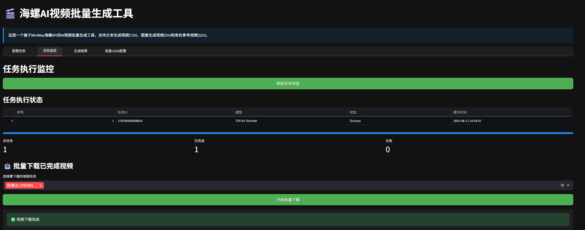
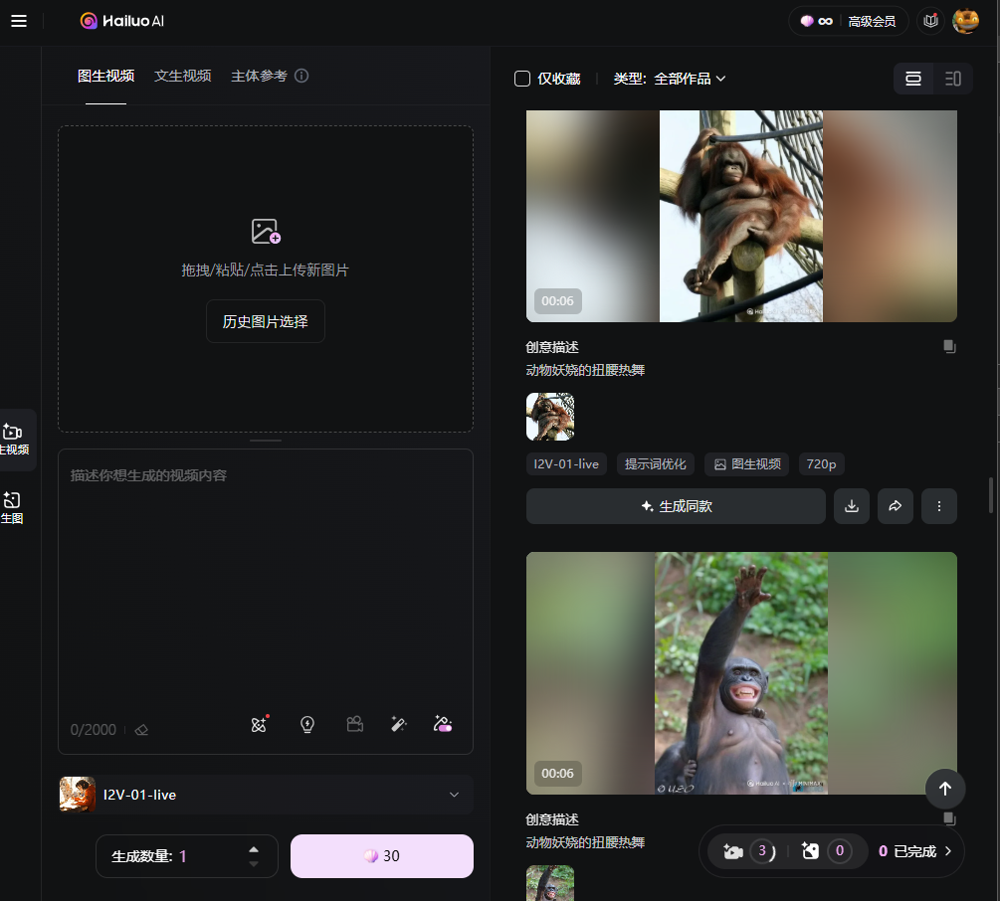
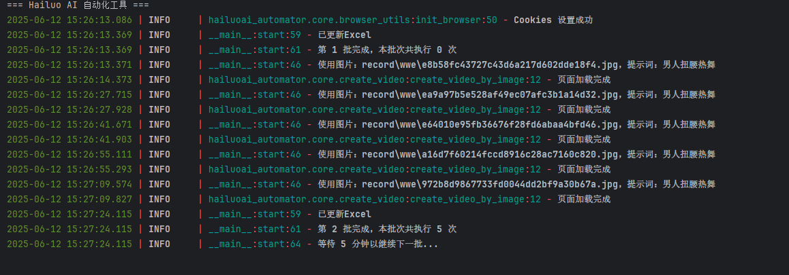
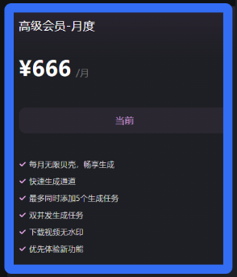
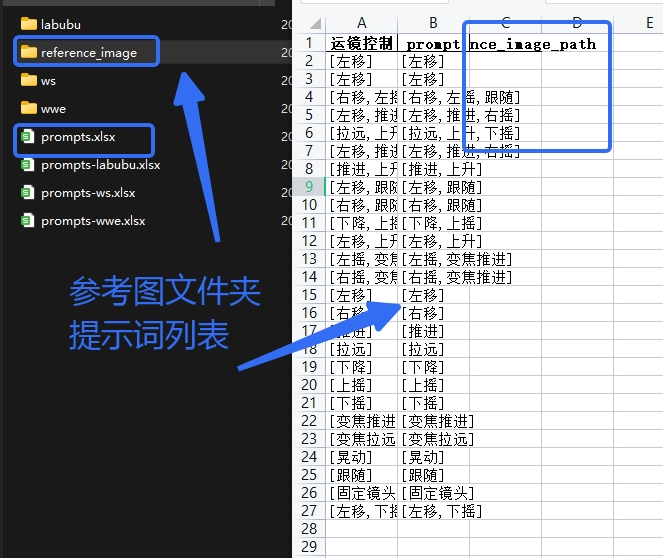

# HaiLuo生图批量工具

## 项目结构

- api_batch：API端的批量生图（接口请求）
- ui_batch: 页面端的批量生图（rpa的方式）

## 用于HaiLuoAPI端的批量文生图、首位帧生图、参考图生图工具
[API费用申请](https://platform.minimaxi.com/document/video_generation?key=66d1439376e52fcee2853049)
此工具适用于开通API的情况,申请API的密钥信息，配置到.env中
### 快速使用
- api_batch目录下
- pip -r requirements.txt 安装依赖
- streamlit run hailuo_ui.py

## 用于HaiLuo页面端的批量图生图工具

### 快速使用

此工具适用于，使用月度666 高级无限账号
6s视频长度， 全天跑可生成800个视频

