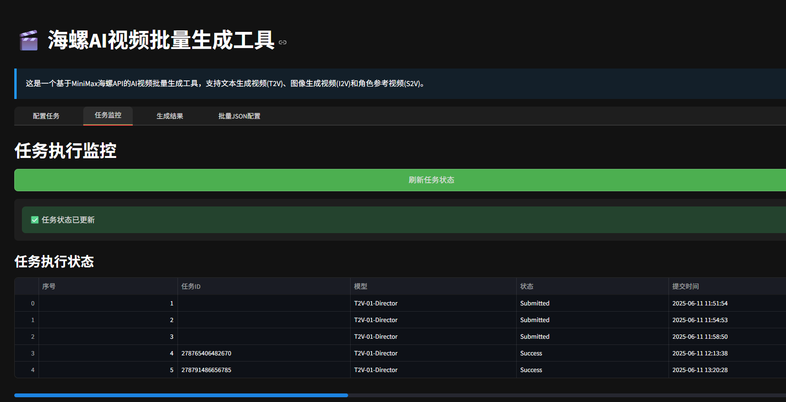

# HaiLuo生图批量工具

## 项目结构

- api_batch：API端的批量生图（接口请求）
- ui_batch: 页面端的批量生图（rpa的方式）

## 用于HaiLuoAPI端的批量文生图、首位帧生图、参考图生图工具

[API费用申请](https://platform.minimaxi.com/document/video_generation?key=66d1439376e52fcee2853049)
此工具适用于开通API的情况,申请API的密钥信息，配置到.env中

### 快速使用

- api_batch目录下
- pip -r requirements.txt 安装依赖
- streamlit run hailuo_ui.py
  



## 用于HaiLuo页面端的批量图生图工具


此工具适用于，使用月度666 高级无限账号
6s视频长度， 全天跑可生成800个视频

### 快速使用

- 登录浏览器页面，复制自己的账号cookie配置到.env中
- ui_batch目录下
- pip -r requirements.txt 安装依赖
- 打开main.py 文件，编辑对应的参数

```
# 参考图目录
reference_image_dir = "record/wwe"
# 提示词列表目录
excel_file = "record/prompts-wwe.xlsx"
# xlsx的sheet名称
sheet_name = "Sheet1"

```


